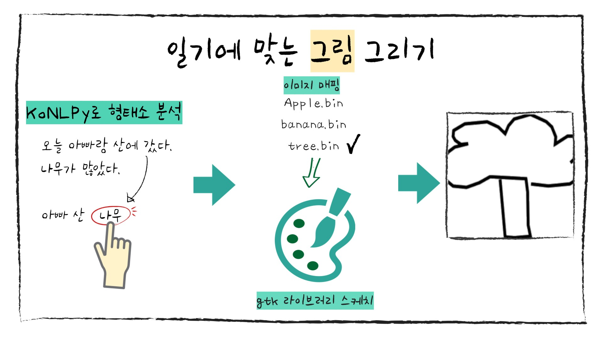
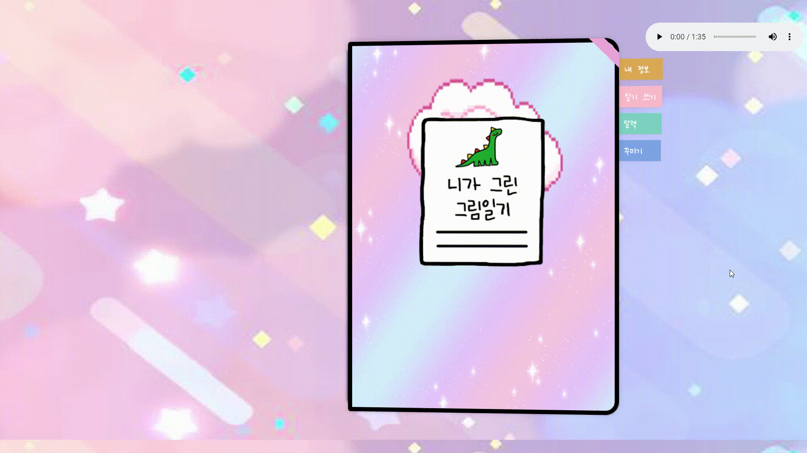
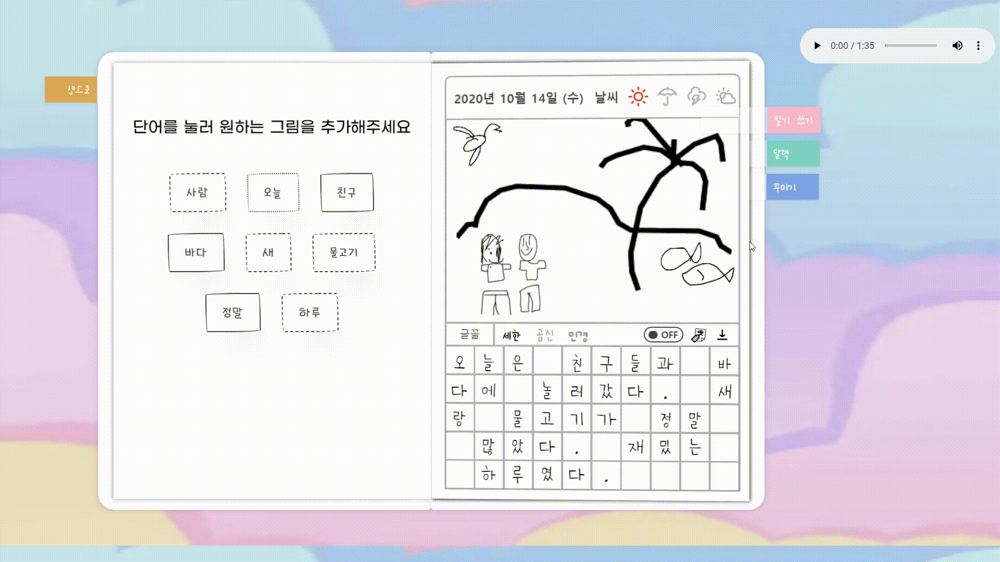
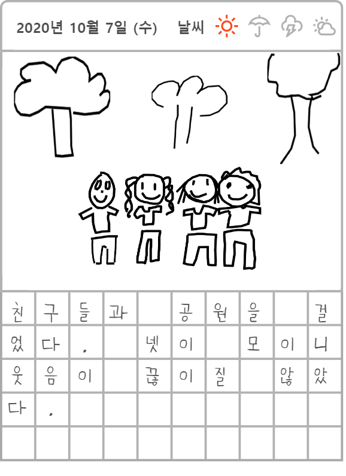
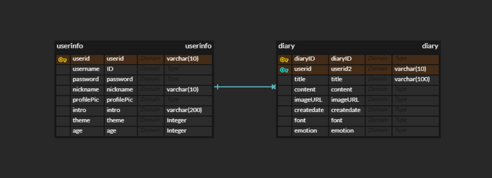

# 🎨 니가 그린 그림일기 

> 글은 내가 쓸게 그림은 누가 그릴래?

<br>

## [🎬니가 그린 그림일기 UCC 보러가기](https://www.youtube.com/watch?v=Z8lDrQTHGl0)

<br><br>

# 🎉 수상내역
### 🥇 특화 프로젝트 서울 2반 최종 1등
### 🥉 UCC 공모전 최종 3등

<br><br>

# 🌞 기획 의도
- 힘들고 지친 젋은이들의 감성 자극
- 어릴 적 동심을 되살려보자
- 하루하루 간단한 기록을 남겨보는 건 어떨까?
- 직접 그리지 않아도 그림이 그려지면 편할 것 같다
- 일상을 공유하자
- 나의 일기를 AI는 어떻게 생각할까?

<br><br>

# 🌟 주요 기능
## ✅ 일기 쓰기


<br>

### 👩‍🎨 일기에 맞는 그림 그리기

- 단어 추출 후 단어에 맞는 그림 제공
1. KoNLPy로 형태소 분석
2. 단어와 이미지 파일 매핑
3. 매핑된 파일을 gtk 라이브러리 스케치를 이용하여 그려줌
4. 그려진 이미지를 화면에 띄워줌

<br>

### 👨‍🎨 사진을 그림으로 그리기

- 사용자가 등록한 사진을 그림으로 변환하여 제공
- Tensorflow Object Detection Model 사용

<br>

## ✅ 감정 분석

- 일기 내용을 통한 감정 분석
- 기쁨, 슬픔, 화남, 중립으로 분류하여
- 맑음, 비옴, 번개, 구름의 날씨로 치환됩니다


- KoBert 사용
- 학습 과정에서 약 1만개의 감정 데이터 사용
- 정확도를 높이기 위해서...
  - AI가 만들어낸 결과와 만 오천개의 감정 단어 사전을 통해 도출한 결과에 가중치를 적용하여 감정을 분석

<br><br>

# ⭐ 추가 기능
## ✅ 다이어리 꾸미기

- 다이어리 표지와 사이트 배경을 원하는대로 꾸밀 수 있어요
## ✅ 달력

- 달력에서 모아보기
- 내가 언제 일기를 썼을까?
## ✅ 그리기

- 인공지능이 데려온 그림만으로 모자른 느낌이 들 때,
- 그리기 모드를 ON하여 직접 그림을 그려보아요
## ✅ 저장하기
- 귀엽고 인공지능이 그려준 그림일기를 파일로 저장할 수 있어요


<br><br>

# 💻 개발
## 📆 기간
2020.08.31 - 2020.10.08

<br>

## 🔥 2학년1반 개발자들
### 👩‍💻 최윤주
> 최고의 팀원들 함께 할 수 있어 행복했습니다
- 팀장
- 프론트엔드
### 👩‍💻 고유진
- 백엔드
- 서버 관리
- 영상 제작
### 👩‍💻 김지현
- 백엔드
- 그림 담당
### 👨‍💻 김형준
- 백엔드
- 감정 분석가
### 👩‍💻 정무영
- 프론트엔드

<br>

## 🌈 기술 스택
                 

<br>

## 📚 ERD


<br>
<br>

# 개발 환경 설정
## Backend
### 1) virtualenv 라이브러리 설치
```
pip install virtualenv
```
### 2) virtualenv 명령을 통한, 가상환경 생성
```
virtualenv 가상환경이름

# 파이썬 버전 지정하여 생성하기
virtualenv 가상환경이름 --python=python3.7 
```
현재 디렉토리에 가상환경이름 으로 디렉토리가 생성이 됩니다.

### 3) 생성된 가상환경 활성화
맥/리눅스와 윈도우는 쉘환경이 다르기 때문에, 활성화 방법이 다릅니다.
```
# Window
가상환경이름/Scripts/activate

# Mac/Linux
source 가상환경이름/bin/activate
```
지금부터 pip를 통해 설치하는 모든 라이브러리는 가상환경이름 디렉토리 내에 모두 설치가 됩니다. 고로 다른 가상환경의 라이브러리가 버전 충돌이 일어나지 않습니다.

그리고 python 명령을 사용되는 라이브러리도 가상환경이름 내 라이브러리를 사용하게 됩니다.

### 4) pip 명령을 통해, 필요한 라이브러리 설치
```
# requirements.txt 내에 명시된 라이브러리들을 한 번에 설치하기
pip install --requirement requirements.txt
# 혹은
pip install -r requirements.txt
```
### 5) 현 가상환경 내에서 프로젝트 개발
### 6) deactivate 명령으로 현재 가상환경 비활성화
```
deactivate
```

<br>

## Django
`/backend/mydiary/mydiary` 폴더 내에 `secret.json` 파일과 `mysettings.py` 파일 추가
```
secret.json

{
    "SECRET_KEY": "시크릿키"
}
```
```
mysettings.py

#DATABASES 설정
DATABASES = {
    'default': {
        'ENGINE': 'django.db.backends.mysql',
        'NAME': 'db이름',
        'USER' : '사용자이름',
        'PASSWORD' : 'db비밀번호',
        'HOST' : '호스트명',
        'PORT' : '3306'
    }
}
```

<br>

## Frontend
```
npm install
```

### Compiles and hot-reloads for development
```
npm run serve
```

<br>
